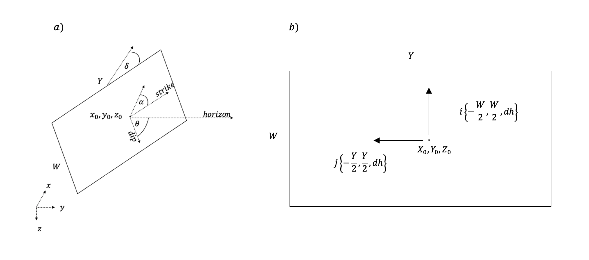
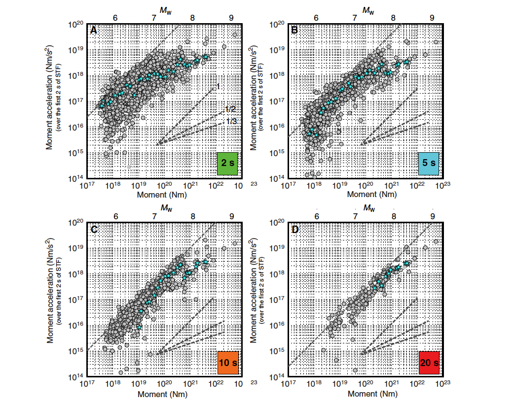

# MOR-SM
Moment rate oriented slip model 
```python
import MORSM
from IPython.display import Image
%matplotlib widget
from mpl_toolkits import mplot3d
```


```python
# Copyright (C) by Almog Blaer 


  __  __  ____  _____        _____ __  __ 
 |  \/  |/ __ \|  __ \      / ____|  \/  |
 | \  / | |  | | |__) |____| (___ | \  / |
 | |\/| | |  | |  _  /______\___ \| |\/| |
 | |  | | |__| | | \ \      ____) | |  | |
 |_|  |_|\____/|_|  \_\    |_____/|_|  |_|
                                      
                                      
# Get ready and fasten your seat belts, we are going to launch a synthetic earthquake at any location you wish.
# This code can depict a finite segment that is aimed to be planted in SW4 software.
# All you need is to tell us  about your computetional domain and  about the segment's kinematic.

# the general code steps are:
# 1. Defining the the segment's dimensions (width,length and slip by Goda (2016) equations for desired magnitude
# 2. Fitting a location parameters for the slip and time functions
# 3. Computing the sliding time (Tm) from stage I and stage II for velocity I and velocity II respectively 
# 4. The features above are distributed by the time and slip function on each pixel on the segment
# 5. You can generate  STF for the earthquake you have just set. 
```


# MOR-SM parameters setting


```python
# dh: set the grid spacing in your computational domain
# Xc: set north-south Cartesian location of the segment's center
# Yc: set the location east-west Cartesian location of the segment's center
# Zc: set the depth hypocenter in Cartesian location of the segment's center
# dip: segment's dip
# strike: segment's strike
# alpha: segment's angle frim the horizon
# Ga: Shear modulus 
# Vr_2:  set the second velocity od the segment of stage II
# Vr_1: set the first velocity od the segment  of stage I
# aH: set the max slip location (down-up direction)
# bH: set the max slip location (south-north or east-west direction)
# aD: set the first pixel location time to operate in the segment (down-up direction)
# bH: -0.4 set the first pixel location time to operate in the segment (south-north or east-west direction)
# sec_stage1: set how long  the first stage will be with Vr_1
# EveMag: set the desired magnitude
```


```python
Image('Computational domain.png')
```


    

    


```python
MORSM.params['Vr_1']=1000
MORSM.params['Vr_2']=2500
MORSM.params['aH']=-0.2
MORSM.params['aD']=-0.6
MORSM.params['bH']=-0.2
MORSM.params['bD']=-0.6
MORSM.params['EveMag']=7.0
MORSM.params['sec_stage1']=1
MORSM.params
```


    {'dh': 171,
     'Xc': 175489.469137,
     'Yc': 127683.51375307699,
     'Zc': 10000,
     'dip': 90,
     'strike': 0,
     'alpha': 0,
     'Ga': 30000000000.0,
     'Vr_2': 2500,
     'Vr_1': 1000,
     'aH': -0.2,
     'bH': -0.2,
     'aD': -0.6,
     'bD': -0.6,
     'sec_stage1': 1,
     'EveMag': 7.0}


```python
Image('melgar, 2019.png')
# Melgar, D., & Hayes, G. P. (2019). Characterizing large earthquakes before rupture is complete. Science Advances, 5(5), 1–8. https://doi.org/10.1126/sciadv.aav2032
```


    

    


```python
MORSM.createfig(first_y_ticks=5e18,seconed_y_ticks=2e18,x_ticks=5)
```


    Canvas(toolbar=Toolbar(toolitems=[('Home', 'Reset original view', 'home', 'home'), ('Back', 'Back to previous …


# Create slip and time distribution


```python
MORSM.Slip_and_time_distribution()
```


    Canvas(toolbar=Toolbar(toolitems=[('Home', 'Reset original view', 'home', 'home'), ('Back', 'Back to previous …


# Save file


```python
MORSM.saveslipmodel_sw4('Simulation_name.txt')
```

    #Vr_1 [m/sec]=1000
    #Vr_2 [m/sec]=2500
    #dh [m]=171
    #Xc=175489.469137
    #Yc=127683.51375307699
    #Zc=10000
    #dip [deg]=90
    #strike [deg]=0
    #aplha [deg]=0
    #Ga [Pa]=30000000000.0
    #aH=-0.2
    #bH=-0.2
    #aD=-0.6
    #bD=-0.6
    
    
    #Fault area [km^2] 1055.28
    #Magnitude [Mw] 7.15
    #Seismic moment [Nm] 66485410042030063616.00
    #Total Slip [m] 75790.17
    #length [m] 48366.48
    #width [m] 21818.45
    #The mean Slip [m] 2.09
    


```python

```
